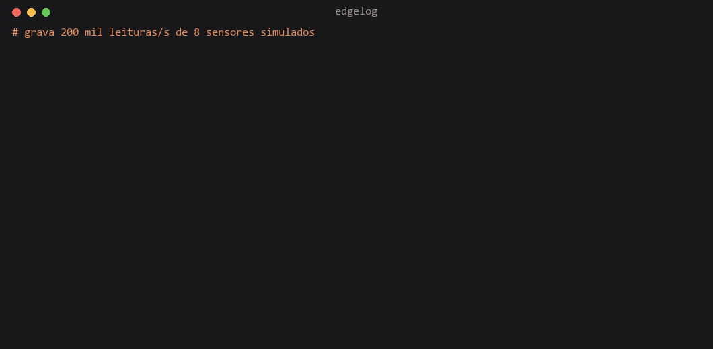
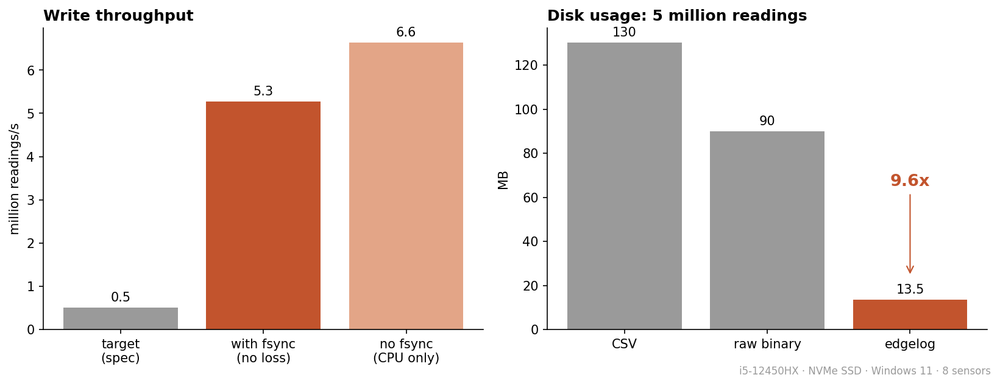

<div align="center">

# edgelog

**Logging sensor telemetry at millions of readings per second without losing anything when the power goes out**

A command-line logger for the computer that sits next to the machine: it takes sensor readings
(simulator, MQTT or stdin), writes them to its own format with a write-ahead log and compressed
blocks, and comes back intact after a shutdown in the middle of a write.

[](https://www.rust-lang.org)
[](https://facebook.github.io/zstd/)
[](https://mqtt.org)
[](.github/workflows/ci.yml)

`5.3 million readings/s with fsync · 9.6x smaller than CSV · 0 corrupted blocks after kill mid-write`

[Português](README.md) &nbsp;·&nbsp; **English**

</div>





---

## In a nutshell

> Picture a factory machine with sensors measuring current and temperature thousands of times per
> second. Someone has to write all of that down, and the "notebook" is the disk of the computer next
> to the machine. edgelog is that note-taker: it writes fast (over 5 million readings per second),
> it writes small (a file almost 10 times smaller than a CSV spreadsheet) and, if the power goes out
> in the middle of a note, it knows exactly where it stopped when it comes back, throws away only the
> half-written line and carries on. Nothing that was already saved is lost.

## Background

At work at Descartee I build production systems, and in Cyber-Physical Systems Engineering
(PUC-SP) I deal with sensors and IoT. The two meet at an annoying spot: sensor data arrives
faster than a Python script can safely write it, and the shop-floor PC shuts down without
warning. I wanted to understand how a real logger handles that, and used it as my first serious
Rust project.

## The problem

A current sensor sampled at 10 kHz on 8 channels is already 80 thousand readings per second.
Writing that as CSV causes three problems at once:

1. **Size.** Each reading turns into about 26 bytes of text. One day of logging goes past 150 GB.
2. **Throughput.** Formatting text and calling `write` per line can't keep up, and the queue grows until memory runs out.
3. **Power loss.** If the PC dies mid-write, the last line is cut in half and, depending on the
   file system, whatever was in the cache goes with it.

## How it works

**In plain words:** two workers share the job. One receives the readings and puts them in a queue;
the other takes them from the queue and writes them to disk. If the queue fills up, the receiver
waits a little instead of letting the desk overflow. Before writing the clean copy, the writer keeps
a quick draft (the WAL) every tenth of a second, so even if the computer shuts down suddenly, the
draft is there to recover from. Every so often the draft is turned into a final, compressed file.

**In technical terms:**

```
 source (thread)               bounded channel              writer (thread)
 ┌───────────────┐            ┌──────────────┐            ┌─────────────────────────────┐
 │ simulator     │  reading   │ 262,144 items│   batch    │ WAL: append + fsync every    │
 │ MQTT          │ ─────────▶ │ backpressure │ ─────────▶ │      100 ms                  │
 │ stdin (JSON)  │            └──────────────┘            │ every 65,536 readings:       │
 └───────────────┘                                        │   compressed block into the  │
                                                          │   segment + reset the WAL    │
                                                          └─────────────────────────────┘
```

- **Bounded queue.** If the disk can't keep up, the source waits instead of memory growing.
  With `--drop-on-full` it drops and counts the drops, for cases where lagging is worse than losing.
- **WAL (write-ahead log).** Every accepted reading first goes into a log of
  `[length][crc32][data]` records, with `fsync` every 100 ms. On power loss, at most that last batch is lost.
- **Recovery.** On startup the WAL is read up to the first record with an impossible length or a
  bad CRC; everything after it is cut. What remains becomes a regular block.
- **Segments.** Every 65,536 readings the writer closes a block and appends it to the current
  `.edl` file, which rotates by size (64 MB) or time (1 h).

### Block format

**In plain words:** instead of writing "sensor 3, 10:00:00.001, 220.51" in full every time,
edgelog only notes what changed since the previous reading. Since a sensor barely changes from one
reading to the next, almost everything becomes zero, and zeros compress very well. Each chunk of the
file also carries a checksum (CRC): if a single bit goes bad, it is detected and only that chunk is skipped.

**In technical terms:** each block has a 32-byte header with `ts_min` and `ts_max`, so `read` skips blocks outside the
requested range without needing an index. Inside the block, readings are split by sensor and
stored as columns:

| Column | Encoding | Why |
|---|---|---|
| timestamp | delta-of-delta + zigzag varint | regular sampling becomes almost all zeros, 1 byte per reading |
| value | XOR with the previous value | nearby values share exponent and high bits, so XOR yields zeros |
| whole block | zstd level 3 + CRC32 | zstd eats the zero runs the two steps above create |

I didn't implement bit-level Gorilla compression (Facebook's time-series codec). Columns +
delta + XOR + zstd reached 9.6x over CSV with much less code to maintain.

A block with a bad CRC is flagged and skipped; the rest of the file stays readable. If power
went out mid-block, the incomplete tail is trimmed on the next start before writing resumes.

## Numbers

Measured with `edgelog bench`, 5 million readings from 8 simulated sensors (sine + Gaussian
noise + fault spikes), on an i5-12450HX with an NVMe SSD on Windows 11:

| | Result |
|---|---|
| Throughput with `fsync` | **5.3 million readings/s** (≈95 MB/s of raw data) |
| Throughput without `fsync` (CPU only) | 6.6 to 7.7 million readings/s |
| Disk: CSV / raw binary / edgelog | 130 MB / 90 MB / **13.5 MB** |
| Compression | **9.6x** over CSV, 6.6x over raw binary |

In other words: `fsync` is the "write it to the disk now, for real" command, bypassing the OS cache.
It is what guarantees no data loss on power failure, and it is expensive. Even with it on, edgelog
runs 10 times above the target I set (500 thousand per second).

With `fsync` on, the bottleneck is the disk (`FlushFileBuffers` on Windows). Without it, it's block encoding.

## Tests

**In plain words:** saying it survives power loss isn't enough, it has to be proven. The tests kill
the program mid-write, corrupt bytes on purpose and cut the file at every possible position, and
check that nothing that was saved got lost.

```
cargo test --release
```

| Test | What it proves |
|---|---|
| `truncamento_em_todo_byte` | the WAL is cut at **every possible byte**; it never returns garbage and never loses a complete record |
| `queda_de_energia` | kills `record` 3 times mid-write at 200k readings/s; `verify` finds 0 corrupted blocks and writing again works |
| `ida_e_volta_um_milhao` | 1 million readings via stdin come out identical, byte for byte, in the CSV |
| `bloco_corrompido_e_pulado` | one flipped byte in the middle of the file takes down only that block |
| `entrada_mqtt` | 10 thousand readings published to mosquitto all arrive (needs a broker, runs with `--ignored`) |

CI runs fmt, clippy with `-D warnings` and the tests on Linux and Windows, plus the MQTT test
against a mosquitto service container.

## Running it

Requires stable [Rust](https://rustup.rs).

```bash
cargo build --release

# record 100k readings/s from the simulator; Ctrl+C to stop
./target/release/edgelog record --source sim --rate 100000 --dir data

# or pipe from the JSON generator
./target/release/edgelog simulate --rate 50000 | ./target/release/edgelog record --dir data

# or subscribe to an MQTT topic (payload: {"sensor_id":1,"valor":3.2} or a list of them)
./target/release/edgelog record --source mqtt --mqtt-host localhost --mqtt-topic "sensores/#"

# export sensor 3 in a time range, check integrity, benchmark
./target/release/edgelog read --dir data --sensor 3 --from 1700000000000000 --format csv --out s3.csv
./target/release/edgelog verify --dir data
./target/release/edgelog bench --count 5000000
```

Write options can also come from a TOML file (`--config gravacao.toml`):

```toml
bloco = 65536        # readings per block
fsync_ms = 100       # max interval between WAL fsyncs
segmento_mb = 64     # rotate segment by size
segmento_seg = 3600  # or by time
```

## Layout

```
src/
  model.rs     18-byte reading (sensor u16, timestamp µs u64, value f64)
  codec.rs     columnar block: delta-of-delta, XOR, zstd, CRC32
  wal.rs       write-ahead log and recovery
  segment.rs   .edl file: writing, reading, corrupted blocks, incomplete tail
  source.rs    simulator, stdin and MQTT, with backpressure
  recorder.rs  writer thread, segment rotation, startup recovery
  main.rs      CLI: record, simulate, read, verify, bench
tests/         integration: round trip, power loss, MQTT
scripts/       benchmark chart
```

The code identifiers and comments are in Portuguese.

## Out of scope

No GUI, no database, no TLS on MQTT and no cloud upload. The focus is the write engine; the CSV
from `read` feeds any other tool.

## License

MIT
