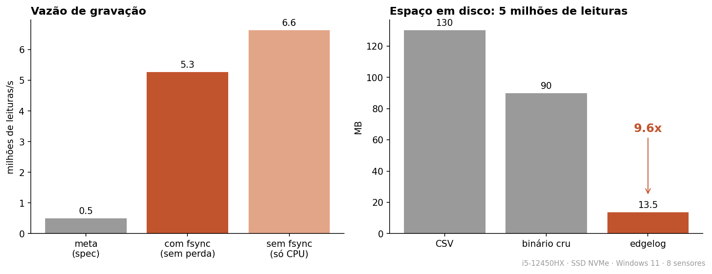

<div align="center">

# edgelog

**Gravar telemetria de sensor a milhões de leituras por segundo sem perder nada quando a luz cai**

Um logger de linha de comando para o computador que fica do lado da máquina: recebe leituras
de sensores (simulador, MQTT ou stdin), grava num formato próprio com write-ahead log e blocos
comprimidos, e volta inteiro depois de um desligamento no meio da escrita.

[](https://www.rust-lang.org)
[](https://facebook.github.io/zstd/)
[](https://mqtt.org)
[](.github/workflows/ci.yml)

`5,3 milhões de leituras/s com fsync · 9,6x menor que CSV · 0 blocos corrompidos depois de kill no meio da gravação`

**Português** &nbsp;·&nbsp; [English](README.en.md)

</div>




---

## Em poucas palavras

> Pense numa máquina de fábrica com sensores medindo corrente e temperatura milhares de vezes por
> segundo. Alguém precisa anotar tudo isso, e o "caderno" é o disco do computador ao lado da máquina.
> O edgelog é esse anotador: escreve rápido (mais de 5 milhões de medidas por segundo), escreve
> pequeno (um arquivo quase 10 vezes menor que uma planilha CSV) e, se a energia cair no meio de uma
> anotação, ao religar ele sabe exatamente onde parou, joga fora só a linha que ficou pela metade e
> continua. Nada do que já tinha sido salvo se perde.

## De onde veio

No meu trabalho na Descartee eu mexo com sistemas de produção, e na Engenharia de Sistemas
Ciberfísicos (PUC-SP) com sensores e IoT. Os dois se encontram num ponto chato: o dado
do sensor chega rápido demais para um script em Python gravar com segurança, e o PC do chão de fábrica
desliga sem avisar. Quis entender como um logger de verdade lida com isso e aproveitei para
escrever meu primeiro projeto sério em Rust.

## O problema

Um sensor de corrente amostrado a 10 kHz em 8 canais já são 80 mil leituras por segundo.
Gravar isso em CSV dá três problemas ao mesmo tempo:

1. **Tamanho.** Cada leitura vira uns 26 bytes de texto. Um dia de coleta passa de 150 GB.
2. **Vazão.** Formatar texto e chamar `write` por linha não acompanha a taxa, e a fila cresce até estourar a memória.
3. **Queda de energia.** Se o PC desliga no meio de uma escrita, a última linha fica pela metade
   e, dependendo do sistema de arquivos, o que estava no cache some junto.

## Como funciona

**Em linguagem simples:** são duas pessoas trabalhando juntas. Uma recebe as medidas e coloca numa
fila; a outra pega da fila e escreve no disco. Se a fila enche, quem recebe espera um pouco, em vez
de a mesa transbordar. Antes de passar a limpo, quem escreve faz um rascunho rápido (o WAL) a cada
décimo de segundo, então mesmo que o computador desligue de repente, o rascunho está lá para
recuperar. De tempos em tempos o rascunho é passado a limpo, compactado, num arquivo definitivo.

**Em linguagem técnica:**

```
 fonte (thread)                canal limitado               gravador (thread)
 ┌───────────────┐            ┌──────────────┐            ┌─────────────────────────────┐
 │ simulador     │  leitura   │ 262.144 itens│   lote     │ WAL: append + fsync a cada   │
 │ MQTT          │ ─────────▶ │ backpressure │ ─────────▶ │      100 ms                  │
 │ stdin (JSON)  │            └──────────────┘            │ a cada 65.536 leituras:      │
 └───────────────┘                                        │   bloco comprimido no        │
                                                          │   segmento + zera o WAL      │
                                                          └─────────────────────────────┘
```

- **Fila com limite.** Se o disco não acompanha, a fonte espera em vez de a memória crescer.
  Com `--drop-on-full` ela descarta e conta os descartes, para quando atrasar é pior que perder.
- **WAL (write-ahead log).** Toda leitura aceita entra primeiro num log de registros
  `[tamanho][crc32][dados]` com `fsync` a cada 100 ms. Numa queda, perde-se no máximo esse último lote.
- **Recuperação.** Ao iniciar, o WAL é lido até o primeiro registro com tamanho impossível ou CRC
  errado; dali para frente é cortado. O que sobrou vira bloco normalmente.
- **Segmentos.** A cada 65.536 leituras o gravador fecha um bloco e anexa no arquivo `.edl`
  atual, que roda por tamanho (64 MB) ou tempo (1 h).

### O formato do bloco

**Em linguagem simples:** em vez de escrever "sensor 3, 10:00:00.001, 220,51" inteiro toda vez,
o edgelog anota só o que mudou desde a medida anterior. Como sensor varia pouco de uma leitura para
a outra, quase tudo vira zero, e zero se compacta muito bem. Cada pedaço do arquivo também leva
uma "soma de conferência" (CRC): se um único bit estragar, dá para perceber e pular só aquele pedaço.

**Em linguagem técnica:** cada bloco tem um cabeçalho de 32 bytes com `ts_min` e `ts_max`, então o `read` pula os blocos
fora do intervalo pedido sem precisar de índice. Dentro do bloco, as leituras são separadas por
sensor e gravadas em colunas:

| Coluna | Codificação | Por quê |
|---|---|---|
| timestamp | delta-of-delta + varint zigzag | amostragem regular vira quase tudo zero, 1 byte por leitura |
| valor | XOR com o valor anterior | valores próximos dividem expoente e bits altos, o XOR gera zeros |
| bloco inteiro | zstd nível 3 + CRC32 | o zstd come as sequências de zero que as duas etapas acima criam |

Não implementei a compressão Gorilla bit a bit (a do Facebook para séries temporais). Colunas +
delta + XOR + zstd chegaram a 9,6x sobre CSV com bem menos código para manter.

Um bloco com CRC errado é marcado e pulado; o resto do arquivo continua legível. Se a energia
caiu no meio de um bloco, a cauda incompleta é cortada na próxima partida antes de voltar a gravar.

## Números

Medidos com `edgelog bench`, 5 milhões de leituras de 8 sensores simulados (senoide + ruído
gaussiano + picos de falha), num i5-12450HX com SSD NVMe no Windows 11:

| | Resultado |
|---|---|
| Vazão com `fsync` | **5,3 milhões de leituras/s** (≈95 MB/s de dado cru) |
| Vazão sem `fsync` (só CPU) | 6,6 a 7,7 milhões de leituras/s |
| Disco: CSV / binário cru / edgelog | 130 MB / 90 MB / **13,5 MB** |
| Compressão | **9,6x** sobre CSV, 6,6x sobre o binário cru |

Traduzindo: o `fsync` é a ordem "grava no disco agora, de verdade", sem deixar no cache do sistema.
É ele que garante não perder dado na queda de energia, e custa caro. Mesmo com ele ligado, o
edgelog fica 10 vezes acima da meta que eu tinha definido (500 mil por segundo).

O gargalo com `fsync` ligado é o disco (`FlushFileBuffers` no Windows). Sem ele, é a codificação dos blocos.

## Testes

**Em linguagem simples:** não basta dizer que aguenta queda de energia, tem que provar. Os testes
desligam o programa à força no meio da gravação, corrompem bytes de propósito e cortam o arquivo
em todas as posições possíveis, e conferem que nada salvo se perdeu.

```
cargo test --release
```

| Teste | O que prova |
|---|---|
| `truncamento_em_todo_byte` | o WAL é cortado em **cada byte possível**; nunca devolve lixo e nunca perde registro completo |
| `queda_de_energia` | mata o `record` 3 vezes no meio da gravação a 200 mil leituras/s; o `verify` acha 0 blocos corrompidos e gravar de novo funciona |
| `ida_e_volta_um_milhao` | 1 milhão de leituras via stdin saem iguais, byte a byte, no CSV |
| `bloco_corrompido_e_pulado` | um byte trocado no meio do arquivo derruba só aquele bloco |
| `entrada_mqtt` | 10 mil leituras publicadas num mosquitto chegam todas (precisa de broker, roda com `--ignored`) |

O CI roda fmt, clippy com `-D warnings` e os testes em Linux e Windows, mais o teste de MQTT
com um mosquitto como service container.

## Como rodar

Precisa do [Rust](https://rustup.rs) estável.

```bash
cargo build --release

# gravar 100 mil leituras/s do simulador; Ctrl+C para parar
./target/release/edgelog record --source sim --rate 100000 --dir data

# ou encadear com o gerador em JSON
./target/release/edgelog simulate --rate 50000 | ./target/release/edgelog record --dir data

# ou assinar um tópico MQTT (payload: {"sensor_id":1,"valor":3.2} ou uma lista deles)
./target/release/edgelog record --source mqtt --mqtt-host localhost --mqtt-topic "sensores/#"

# exportar o sensor 3 num intervalo, conferir a integridade, medir
./target/release/edgelog read --dir data --sensor 3 --from 1700000000000000 --format csv --out s3.csv
./target/release/edgelog verify --dir data
./target/release/edgelog bench --count 5000000
```

As opções de gravação também podem vir de um TOML (`--config gravacao.toml`):

```toml
bloco = 65536        # leituras por bloco
fsync_ms = 100       # intervalo máximo entre fsyncs do WAL
segmento_mb = 64     # roda o segmento por tamanho
segmento_seg = 3600  # ou por tempo
```

## Estrutura

```
src/
  model.rs     leitura de 18 bytes (sensor u16, timestamp µs u64, valor f64)
  codec.rs     bloco colunar: delta-of-delta, XOR, zstd, CRC32
  wal.rs       write-ahead log e recuperação
  segment.rs   arquivo .edl: escrita, leitura, blocos corrompidos, cauda incompleta
  source.rs    simulador, stdin e MQTT, com backpressure
  recorder.rs  thread de gravação, rotação de segmento, recuperação na partida
  main.rs      CLI: record, simulate, read, verify, bench
tests/         integração: ida e volta, queda de energia, MQTT
scripts/       gráfico do benchmark
```

## O que ficou de fora

Sem interface gráfica, sem banco de dados, sem TLS no MQTT e sem envio para a nuvem. O foco é o
motor de gravação; o CSV do `read` alimenta qualquer outra ferramenta.

## Licença

MIT
